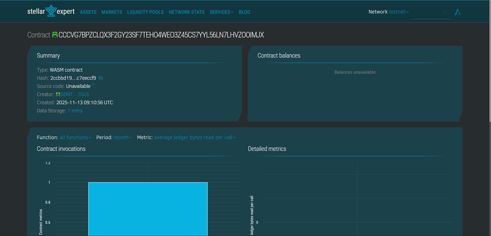

# Tokenized Art Rental Platform

## Project Title
**Tokenized Art Rental Platform Smart Contract**

## Project Description
The Tokenized Art Rental Platform is a decentralized solution built on the Stellar blockchain using Soroban smart contracts. This platform enables art owners to tokenize their artwork and offer it for rental to interested parties. The smart contract facilitates secure artwork registration, rental transactions, and return processes, ensuring transparency and trust between art owners and renters.

Art owners can register their artwork with details such as title and rental price per day. Renters can browse available artworks and rent them for a specified duration. The contract automatically manages the availability status of artworks and tracks rental periods, creating a seamless marketplace for art rentals.

## Project Vision
Our vision is to democratize access to fine art and collectibles by creating a decentralized rental marketplace. We aim to:

- **Empower Art Owners**: Enable individual art owners and galleries to monetize their collections without selling their assets
- **Make Art Accessible**: Allow art enthusiasts, businesses, and interior designers to access premium artwork without the burden of ownership
- **Create Trust**: Use blockchain technology to ensure transparent transactions and secure custody tracking
- **Build Community**: Foster a community where art appreciation is accessible to everyone, regardless of economic barriers
- **Preserve Culture**: Help preserve and circulate cultural artifacts by making them economically viable to maintain through rental income

## Key Features

### 1. **Artwork Registration**
- Art owners can register their artwork on the platform with a unique ID
- Each artwork includes title, owner address, and rental price per day
- Automatic availability tracking ensures artworks can't be double-booked

### 2. **Decentralized Rental System**
- Renters can rent available artwork for a specified duration (in days)
- Smart contract automatically calculates rental periods using blockchain timestamps
- Rental transactions are immutable and transparent

### 3. **Automated Availability Management**
- Artworks are automatically marked as unavailable when rented
- Upon return, artworks become available again for new renters
- Prevents conflicts and ensures only one active rental per artwork

### 4. **Transparent Record Keeping**
- All artwork registrations and rental transactions are stored on-chain
- View functions allow anyone to check artwork details and rental history
- Immutable records provide proof of ownership and rental agreements

## Future Scope

### Phase 1: Enhanced Features
- **Multi-token Support**: Integration with Stellar tokens for payment processing
- **Escrow System**: Implement security deposits and automated refund mechanisms
- **Rating System**: Allow renters and owners to rate each other after transactions
- **Extended Metadata**: Support for artwork images, artist information, and provenance data

### Phase 2: Advanced Functionality
- **Insurance Integration**: Partner with insurance providers for artwork protection during rental
- **Auction Mechanism**: Enable competitive bidding for high-demand artwork rentals
- **Fractional Ownership**: Allow multiple owners to share artwork and split rental income
- **Cross-chain Bridge**: Expand to other blockchain networks for broader accessibility

### Phase 3: Ecosystem Development
- **Mobile Application**: Develop user-friendly mobile apps for iOS and Android
- **NFT Integration**: Link physical artwork to NFTs for digital certificates of authenticity
- **DAO Governance**: Implement decentralized governance for platform decisions
- **Gallery Partnerships**: Integrate with physical galleries and museums for wider art selection
- **Dynamic Pricing**: AI-powered pricing based on demand, artwork value, and rental history

### Phase 4: Market Expansion
- **Global Marketplace**: Multi-language support and regional compliance
- **Enterprise Solutions**: B2B rentals for corporate offices, hotels, and event spaces
- **Subscription Models**: Monthly art subscription plans for regular renters
- **Virtual Exhibitions**: AR/VR integration for remote artwork viewing before rental

---

## Technical Details

**Blockchain**: Stellar  
**Smart Contract Framework**: Soroban SDK  
**Language**: Rust  
**Storage**: Instance storage with TTL management  

## Getting Started

### Prerequisites
- Rust toolchain
- Soroban CLI
- Stellar account for testing

### Building the Contract
```bash
cargo build --target wasm32-unknown-unknown --release
```

### Deploying the Contract
```bash
soroban contract deploy \
  --wasm target/wasm32-unknown-unknown/release/art_rental.wasm \
  --source <YOUR_SECRET_KEY> \
  --rpc-url https://soroban-testnet.stellar.org \
  --network-passphrase "Test SDF Network ; September 2015"
```

## License
This project is open-source and available under the MIT License.

## Contributing
We welcome contributions from the community! Please feel free to submit issues, fork the repository, and create pull requests.

---


**Built with ❤️ for the art community on Stellar Blockchain**


